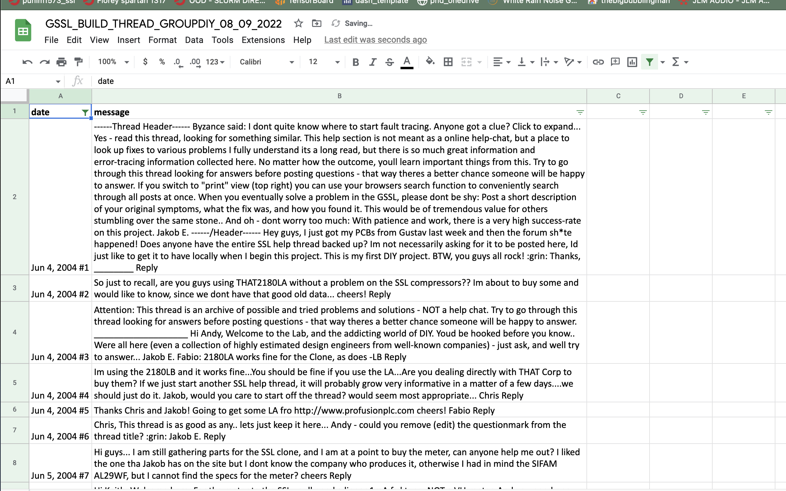

---------

# IF YOU HAVE COME HERE FOR COMPILED BUILD THREAD FOR GYRAF SSL COMP

Here is the csv file with time-stamped commments, starting in 2004.

[COMPILED_GSSL_THREAD.csv](https://docs.google.com/spreadsheets/d/e/2PACX-1vSS_FwQsV4UeOD_JfYzM5SHk555R5p9gVxpgY2Bl2S1JEARZHV6ghMUUN9aiQ__X0h-sGdpz7w4L4ie/pub?output=csv)



------


# IF YOU WANT TO FORK / CONTRIBUTE TO PROJECT

Many thanks go to Jakob Erland & the community at GroupDIY for this wonderful GSSL compressor!

**Motivation**

Like many threads on GroupDIY, the [GSSL help thread](https://groupdiy.com/threads/gssl-help-thread.47/) is many (433) pages long and very hard to search effectively.

So, to solve this problem:
1. This code will collate all the comments from the forum and put them into ```.csv``` file. 
2. Comments are sorted by date
3. Then you can use microsoft excel or google sheets or whatever to filter the message column and search for keywords if you want, like for example:

- ```Resistor R2 Measured volts```
- ```Distortion at low volume```
- ```Oscillation```


This allows you to sift through the relevant comments, rather than asking the exact same question that was answered 6 months ago.

The goal is to simplify and facilitate the process of troubleshooting, so that we can spend more time recording.

The script is python3, uses beautiful soup to scrape the entire thread, and then dumps it into a ```.csv``` file. Should be easy to adapt for other threads.

**build/run instructions:**

```sh
git clone ...
cd scraping_GSSL_groupdiy;
python3 -m venv myvenv;
source myvenv/bin/activate;
pip install -r requirements.txt;
python compile_GSSL.py;
```

Points for improvement
- Incorporate comment upvote score so we can prioritise helpful comments
- Images would be useful
- Hyperlinks would be useful
- Expand to other threads
- Maybe NLP algo to summarise and simplify text


